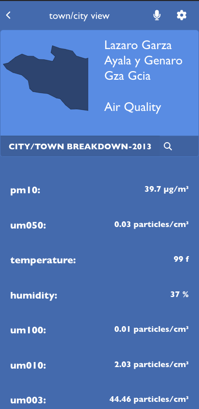

<a name="readme-top"></a>

<div align="center">

  
  <br/>

  <h3><b>Air Quality</b></h3>

</div>

<!-- TABLE OF CONTENTS -->

# 📗 Table of Contents

- [📖 About the Project](#about-project)
  - [🛠 Built With](#built-with)
    - [Tech Stack](#tech-stack)
    - [Key Features](#key-features)
    - [🚀 Live Demo](#live-demo)
    - [🚀 Project Presentation](#project-presentation)
- [💻 Getting Started](#getting-started)
  - [Prerequisites](#prerequisites)
  - [Setup](#setup)
  - [Install](#install)
  - [Usage](#usage)
  - [Run tests](#run-tests)
  - [Deployment](#deployment)
- [👥 Authors](#authors)
- [🔭 Future Features](#future-features)
- [🤝 Contributing](#contributing)
- [⭐️ Show your support](#support)
- [🙏 Acknowledgements](#acknowledgements)
- [❓ FAQ (OPTIONAL)](#faq)
- [📝 Attribution](#attribution)
- [📝 License](#license)

<!-- PROJECT DESCRIPTION -->

# 📖 Air-quality <a name="about-project"></a>

Air-quality is a full stack app that displays numeric air-quality data from various weather stations.The applications gets data from the api using axios and updates its states using redux-toolkit.Ths application was developed with quality and responsiveness in mind using react test library for TDD and react-boostrap for the ui.
 
  

## 🛠 Built With <a name="built-with"></a>

### Tech Stack <a name="tech-stack"></a>


<details>
  <summary>React</summary>
  <ul>
    <li><a href="https://react.dev/">React.js</a></li>
  </ul>
</details>

<details>
  <summary>Redux</summary>
  <ul>
    <li><a href="https://redux.js.org/">Redux-toolkit</a></li>
  </ul>
</details>

<details>
  <summary>Node js</summary>
  <ul>
    <li><a href="https://nodejs.org/en">Redux-toolkit</a></li>
  </ul>
</details>

<details>
  <summary>Axios</summary>
  <ul>
    <li><a href="https://axios-http.com/">Axios</a></li>
  </ul>
</details>

 <details>
  <summary>API</summary>
  <ul>
    <li><a href="https://api.openaq.org/">Open AQ API</a></li>
  </ul>
</details>

 <details>
  <summary>React Bootstrap</summary>
  <ul>
    <li><a href="https://react-bootstrap.github.io/">React Bootstrap</a></li>
  </ul>
</details>

 <details>
  <summary>React Testing Library</summary>
  <ul>
    <li><a href="https://testing-library.com/docs/react-testing-library/intro/">React Bootstrap</a></li>
  </ul>
</details>

<!-- Features -->
## 🛠 Key Features <a name="key-features"></a>
### Features <a name="key-features"></a>

**Home Page:Display Air Quality Data**
**Details Page:Display Air Quality Data details**
**Filter:Filter data based on keywords**

<p align="right">
(<a href="#readme-top">back to top</a>)</p>

<!-- LIVE DEMO -->
 ## 🚀 Live Demo <a name="live-demo"></a>

- [Live Demo](https://air-quality-e96p.onrender.com)

## 🚀 Project Presentation <a name="project-presentation"></a>

- [Project Presentation ](https://www.loom.com/share/a0e8aafa6cdf45a9a7a0e07eac834d92?sid=fc3729f8-0efd-439c-a260-7991e9cddd6c)

<p align="right">(<a href="#readme-top">back to top</a>)</p>

<!-- GETTING STARTED -->

## 💻 Getting Started <a name="getting-started"></a>

To get a local copy up and running, follow these steps.

### Prerequisites

In order to run this project you need:


### Setup

Clone this repository to your desired folder:


```sh
cd my-folder
git clone https://github.com/RileyManda/air-quality.git
```


### Install

Install this project with:


```sh
  cd my-project
  npm i
```


### Usage

To run the project, execute the following command:


```sh
  npm start
```


### Run tests

To run tests, run the following command:

```sh
  npm test
```


### Deployment

You can deploy this project using:
    
```sh
    npm run build
```
 ```sh
    gh-pages deploy --dist build
```


<p align="right">(<a href="#readme-top">back to top</a>)</p>

<!-- AUTHORS -->

## 👥 Authors <a name="authors"></a>

👤 **RileyManda**

- GitHub: [@RileyManda](https://github.com/RileyManda)
- Twitter: [@rilecodez](https://twitter.com/rileycodez)
- LinkedIn: [rileymanda](https://www.linkedin.com/in/rileymanda/)


<p align="right">(<a href="#readme-top">back to top</a>)</p>

<!-- FUTURE FEATURES -->

## 🔭 Future Features <a name="future-features"></a>

- [ ] **[Search and filter by city]**


<p align="right">(<a href="#readme-top">back to top</a>)</p>

<!-- CONTRIBUTING -->

## 🤝 Contributing <a name="contributing"></a>

Contributions, issues, and feature requests are welcome!

Feel free to check the [issues page](https://github.com/RileyManda/Air-quality/issues).

<p align="right">(<a href="#readme-top">back to top</a>)</p>

<!-- SUPPORT -->

<!-- SUPPORT -->
## <b>Show your support 🌟</b><a name="support"></a>

Thank you for taking the time to explore this project! Your support means a lot to me. If you find my project valuable and would like to contribute, here is one way you can support me:

 - <b>Star the project ⭐️</b>: Show your appreciation by starring this GitHub repository. It helps increase visibility and lets others know that the project is well-received.

 - <b>Fork the project 🍴 🎣</b>: If you're interested in making improvements or adding new features, feel free to fork the project. You can work on your own version and even submit pull requests to suggest changes.

 - <b>Share with others 🗺️</b>: Spread the word about this project. Share it on social media, mention it in relevant forums or communities, or recommend it to colleagues and friends who might find it useful.

<p align="right">(<a href="#readme-top">back to top</a>)</p>

<!-- ACKNOWLEDGEMENTS -->

## 🙏 Acknowledgments <a name="acknowledgements"></a>

I would like to express my sincere gratitude to [Microverse](https://github.com/microverseinc), the dedicated reviewers, and collaborators. Your unwavering support, feedback, and collaborative efforts have played an immense role in making this journey a resounding success. I am truly grateful for your contributions and for being an integral part of my achievements.
I would like to also send out special thanks to [Nelson Sakwa
](https://www.behance.net/gallery/31579789/Ballhead-App-(Free-PSDs)) for the original Ux design that inspired this project.
Thank you for your continued support.

<p align="right">(<a href="#readme-top">back to top</a>)</p>

<!-- FAQ (optional) -->

## ❓ FAQ <a name="faq"></a>

- **Question_1**

  Do I have to use the vs code specifically?

  - Answer_1

    You can use any code editor of your choice. <br>

- **Question_2**

  Where can I download node JS for installation?

  - Answer_2

  Node.js® is a JavaScript runtime built on Chrome's V8 JavaScript engine.
  It can be downloaded [here](https://nodejs.org/en).


<p align="right">(<a href="#readme-top">back to top</a>)</p>

<!-- ATTRIBUTION -->

## 👥 Attribution <a name="attribution"></a>
- This project is based on the Original design by: [Nelson Sakwa
](https://www.behance.net/gallery/31579789/Ballhead-App-(Free-PSDs))
- Original logo design from: [Svgrepo](https://www.svgrepo.com/)

<!-- LICENSE -->

## 📝 License <a name="license"></a>

[](./LICENSE)

<p align="right">(<a href="#readme-top">back to top</a>)</p>

